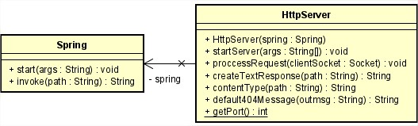

## TALLER DE ARQUITECTURAS DE SERVIDORES DE APLICACIONES, META PROTOCOLOS DE OBJETOS, PATRÓN IOC, REFLEXIÓN
### Miguel Ángel Rodríguez Siachoque
### 14 de Septiembre de 2021

### Descripción
Para este taller los estudiantes deberán construir un servidor Web (tipo Apache) en Java. El servidor debe ser capaz de entregar páginas html e imágenes tipo PNG. Igualmente el servidor debe proveer un framework IoC para la construcción de aplicaciones web a partir de POJOS. Usando el servidor se debe construir una aplicación Web de ejemplo y desplegarlo en Heroku. El servidor debe atender múltiples solicitudes no concurrentes. 
Para este taller desarrolle un prototipo mínimo que demuestre capcidades reflexivas de JAVA y permita por lo menos cargar un bean (POJO) y derivar una aplicación Web a partir de él. Debe entregar su trabajo al final del laboratorio.

### Requisitos :
> - Java 1.8
> - Maven 
> - Spring

### Heroku - Fachada

### Ejecución comando:
> mvn exec:java -D"exec.mainClass"="edu.escuelaing.arem.App.App" 

### Descripción de la aplicación
#### Package: App - App.java
 
Esta clase inicia la ejecución de la aplicación, iniciando los servicios de ___Servidor___ y ___Spring___.
#### Package: Controller - Controller.java
 
Esta clase inicia los controles del valor del ___Spring___, con lo cual relaciona peticiones de tipo ___http___ permitiendo controlar y agrupar las ___URLs___.
#### Package: Controller - GetMapping.java
 
Esta interface que utilizamos para procesar las solicitudes de la obtencion del ___RequestMapping___, con lo cual se puedo obtener las peticiones de tipo ___http___.
#### Package: Spring - Spring.java
 
Esta clase ayuda a manejar el ___Spring___ para crear la aplicación complementado con las clases ___Java___, usando las librerias y utilidades que permiter realizar el proceso del ___framework___.
#### Package: HttpServer - HttpServer.java
 
Esta clase ejerce el proceso del ___Servidor HTTP___ con el cual se procesa la aplicación del servidor y poder realizar las conexiones con el cliente, generando una respuesta al cliente.

## JavaDoc:
[JavaDoc - ClienteServer](JavaDocs/index.html)